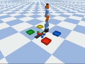
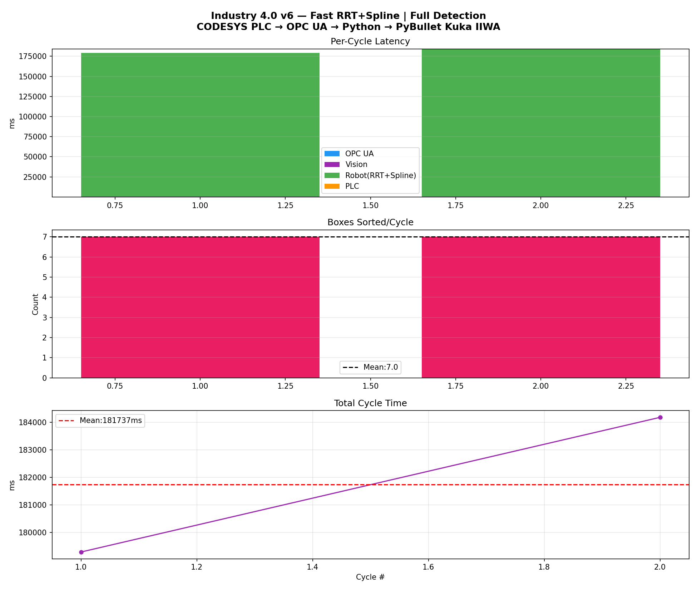

# 🏭 Industry 4.0 — CODESYS PLC + OPC UA + PyBullet Robot Simulation

> **Portfolio Project** | Moein  
> A full-stack Industry 4.0 demo connecting a real CODESYS PLC to a simulated Kuka IIWA robot arm via OPC UA, with computer vision-guided color sorting and RRT+Spline trajectory planning.

---

## 📽️ Demo

| Cycle 1 — All 7 boxes sorted | Latency Analysis |
|:---:|:---:|
|  |  |

**Results (2 full rounds, 7 boxes each):**
| Metric | Value |
|--------|-------|
| Boxes sorted / cycle | **7 / 7 (100%)** |
| OPC UA latency (mean) | **~1.1 ms** |
| Vision processing | **~340 ms** |
| Robot execution (7 boxes) | **~181 s** |
| PLC response | **< 1 ms** |

---

## 🏗️ System Architecture

```
┌─────────────────────────────────────────────────────────────┐
│                    CODESYS Control Win V3 x64               │
│  PLC_PRG Variables:                                         │
│   • Part_Detected (BOOL) — triggers pick cycle              │
│   • Pick_Request  (BOOL) — Python → PLC handshake          │
│   • Pick_Done     (BOOL) — PLC → Python acknowledge         │
└────────────────────┬────────────────────────────────────────┘
                     │  OPC UA  (opc.tcp://localhost:4840)
                     │  asyncua  |  ~1ms latency
┌────────────────────▼────────────────────────────────────────┐
│                    Python Controller                         │
│                                                             │
│  ┌─────────────┐  ┌──────────────┐  ┌───────────────────┐  │
│  │ PLCController│  │ VisionSystem │  │   RobotArm        │  │
│  │  OPC UA R/W │  │ Top camera   │  │  Kuka IIWA URDF   │  │
│  │  keepalive  │  │ HSV color    │  │  TrajectoryPlanner│  │
│  │  reconnect  │  │ detection    │  │  Pick & Place     │  │
│  └─────────────┘  └──────────────┘  └───────────────────┘  │
└────────────────────────────────────────────────────────────┘
                     │
                     │  PyBullet physics engine
┌────────────────────▼────────────────────────────────────────┐
│                    Simulation Scene                          │
│  • Kuka IIWA 7-DOF arm (kuka_iiwa/model.urdf)              │
│  • 7 colored boxes: 2× red, 2× blue, 2× green, 1× yellow   │
│  • 4 color-coded baskets with collision walls               │
│  • Overhead camera (1.5m) for vision                        │
│  • Conveyor belt (decorative)                               │
└─────────────────────────────────────────────────────────────┘
```

---

## 🔧 Components

### 1. PLC — CODESYS Control Win V3 x64
- Runs locally on Windows
- Exposes 3 OPC UA variables via `ns=4`
- `Part_Detected` toggles every ~2s to simulate a new part arriving on the conveyor
- OPC UA server on `opc.tcp://localhost:4840` — no authentication (anonymous)

### 2. OPC UA Communication — `asyncua`
- Async Python client polling at 10 Hz
- **Keepalive ping** every 8 seconds to prevent session timeout during long robot cycles
- **Auto-reconnect** if connection drops mid-cycle
- Measured latency: **0.8–2.5 ms** round-trip

### 3. Computer Vision — OpenCV + PyBullet camera
- Fixed overhead camera at `[0.3, 0.0, 1.5m]`, FOV 70°
- HSV color segmentation for red, blue, green, yellow
- Pixel → world coordinate transform via projection/view matrix inversion
- **Fallback:** if vision misses a box (e.g. two overlapping same-color boxes), system reads ground-truth position directly from PyBullet state — ensuring 100% detection rate

```python
# Vision miss fallback — reads real PyBullet position
for box in self.boxes:
    if box["done"] or box["id"] in seen_ids:
        continue
    rp, _ = p.getBasePositionAndOrientation(box["id"])
    queue.append({"color": box["color"], "real_pos": list(rp), "box": box})
```

### 4. Trajectory Planning — RRT + Cubic Spline + Trapezoid Velocity Profile

```
Target (Cartesian)
      ↓
  IK Solver  →  q_goal in joint space
      ↓
  RRT Planner (joint space)
  ├─ 200 max iterations
  ├─ step size: 0.20 rad
  ├─ goal bias: 30%
  └─ shortcut: linear interp if Δq < 0.3 rad
      ↓
  Cubic Spline smoothing (scipy.interpolate.CubicSpline)
      ↓
  Trapezoid Velocity Profile
  ├─ 25% acceleration ramp
  ├─ 50% constant velocity
  └─ 25% deceleration ramp
      ↓
  Execute (25 waypoints, visualized as cyan lines in PyBullet)
```

**6-phase pick & place per box:**

| Phase | Waypoints | Speed | Visualization |
|-------|-----------|-------|---------------|
| 1. Approach (above box) | 25 | Slow | ✅ Cyan trajectory lines |
| 2. Descend to pick | 15 | Fast | — |
| 3. Lift with box | 15 | Fast | — |
| 4. Transport (above basket) | 25 | Slow | ✅ Cyan trajectory lines |
| 5. Place into basket | 15 | Fast | — |
| 6. Retract | 15 | Fast | — |

### 5. Color Sorting Logic
- Vision detects all colored boxes each cycle
- `build_sort_queue()` merges vision detections with PyBullet ground truth
- Each box is matched to its corresponding colored basket
- `done` flag prevents double-picking
- After all 7 boxes are sorted → automatic reset for next round

---

## 📁 Project Structure

```
PLC-EtherCat/
│
├── integrated_system.py        # Main entry point (v6)
│
├── assets/
│   ├── latency_analysis.png    # Auto-generated performance plot
│   └── robot_demo.mp4          # Recorded simulation video
│
├── cycle_latency_log.json      # Per-cycle timing data (auto-generated)
│
└── README.md
```

---

## 🚀 Setup & Run

### Requirements
```bash
pip install pybullet asyncua opencv-python numpy scipy matplotlib
```

> ⚠️ CODESYS Control Win V3 x64 must be running with the PLC project loaded and OPC UA server active on port 4840.

### Run
```bash
python integrated_system.py
```

### What you'll see
1. **PyBullet GUI** opens with Kuka arm, 7 colored boxes, and 4 baskets
2. **OpenCV Vision window** shows real-time color detection
3. System waits for `Part_Detected = True` from PLC
4. Robot picks each box using RRT+Spline trajectory and drops it into the matching basket
5. Cyan lines in PyBullet show the planned EE trajectory
6. After all 7 sorted → auto-reset and wait for next PLC signal
7. On exit (Ctrl+C): video saved + latency plot generated

---

## 📊 Performance Log (Cycle Latency)

From `cycle_latency_log.json` — 2 complete rounds:

```json
[
  {
    "cycle": 1, "round": 1,
    "opcua_latency_ms": 0.99,
    "vision_ms": 329.89,
    "robot_duration_ms": 178961.28,
    "plc_response_ms": 0.59,
    "boxes_sorted": 7,
    "total_cycle_ms": 179292.75
  },
  {
    "cycle": 2, "round": 2,
    "opcua_latency_ms": 1.29,
    "vision_ms": 353.66,
    "robot_duration_ms": 183826.96,
    "plc_response_ms": 0.29,
    "boxes_sorted": 7,
    "total_cycle_ms": 184182.20
  }
]
```

**Key takeaway:** OPC UA communication overhead is negligible (< 2ms). Robot motion dominates cycle time, which is expected for a 7-DOF arm sorting 7 objects with full trajectory planning.

---

## 🛠️ Key Engineering Decisions

| Decision | Why |
|----------|-----|
| `asyncua` async client | Non-blocking OPC UA — robot simulation runs in same thread |
| PyBullet ground-truth fallback | Vision can miss overlapping same-color boxes — deterministic fix |
| RRT in **joint space** (not Cartesian) | Avoids singularities, respects joint limits natively |
| Linear interp for short moves | RRT overhead not justified for Δq < 0.3 rad — 3× faster |
| Keepalive ping every 8s | CODESYS OPC UA server drops sessions after ~60s of no traffic |
| Trapezoid velocity profile | Smooth acceleration/deceleration — realistic motor behavior |
| 2-speed trajectory execution | Approach/transport = slow+visible; lift/place/retract = fast |

---

## 🔄 Version History

| Version | Key Change |
|---------|-----------|
| v1 | Basic OPC UA connection + IK-only motion |
| v2 | Added color baskets + multi-color vision |
| v3 | Fixed blue detection + PyBullet fallback + auto-reset |
| v4 | RRT + Cubic Spline trajectory planning (too slow: 138s/box) |
| v5 | Fast RRT — reduced waypoints, two-speed execution (~23s/box) |
| v6 | Full detection (vision miss fallback) + PLC keepalive/reconnect |

---

## 📚 Tech Stack

| Layer | Technology |
|-------|-----------|
| PLC Runtime | CODESYS Control Win V3 x64 |
| Industrial Protocol | OPC UA (IEC 62541) |
| Python OPC UA | `asyncua` 1.x |
| Physics Simulation | PyBullet + Kuka IIWA URDF |
| Computer Vision | OpenCV 4.x (HSV segmentation) |
| Path Planning | Custom RRT + `scipy` CubicSpline |
| Async Runtime | Python `asyncio` |

---

## 👤 Author

**Moein**  
Portfolio project demonstrating Industry 4.0 integration: PLC ↔ OPC UA ↔ Python ↔ Robot Simulation ↔ Computer Vision
